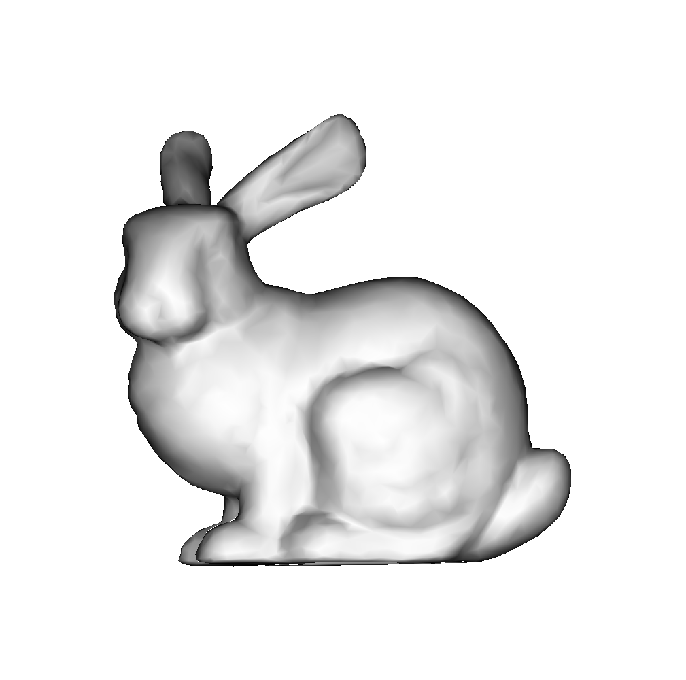
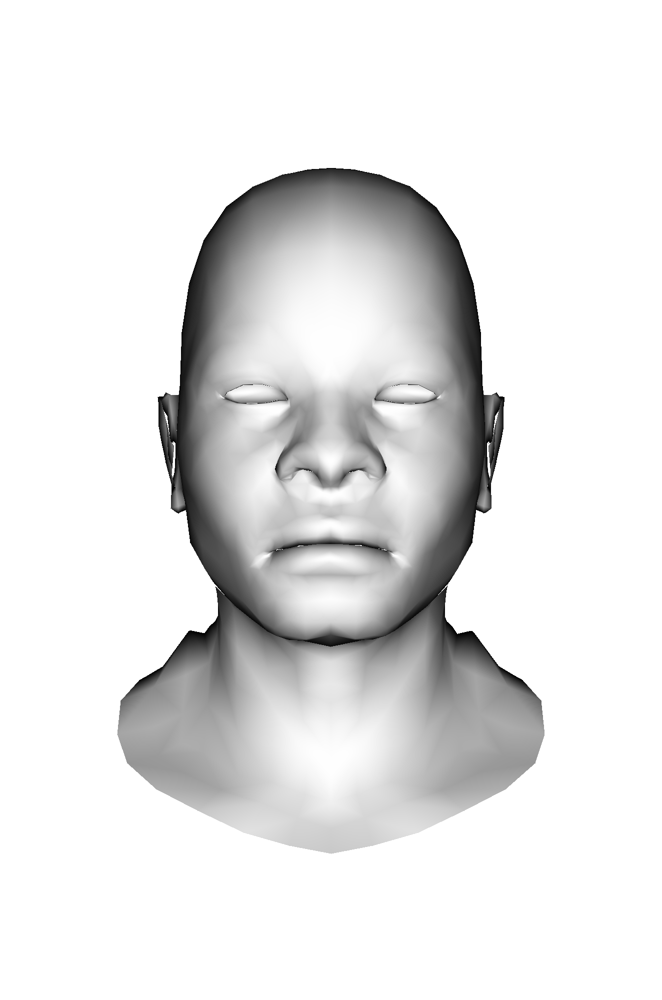
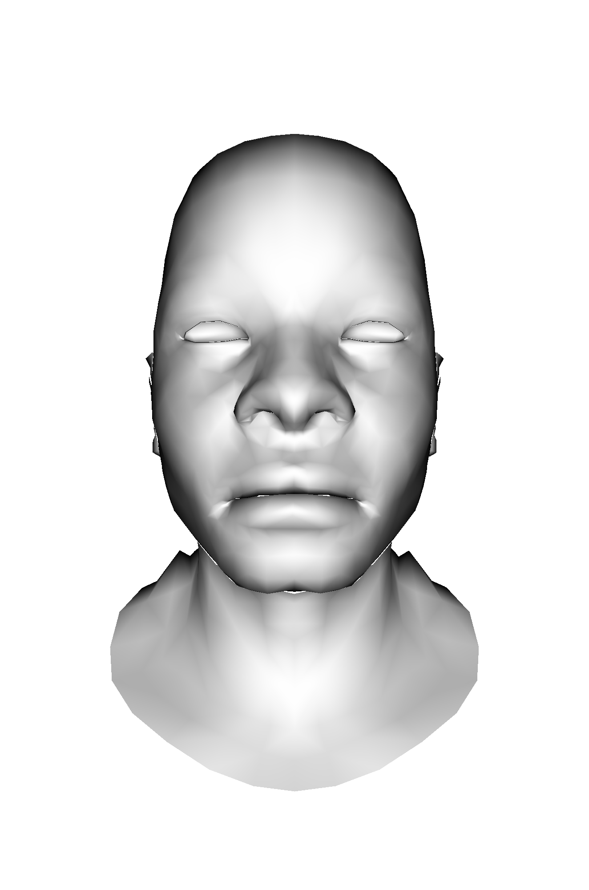
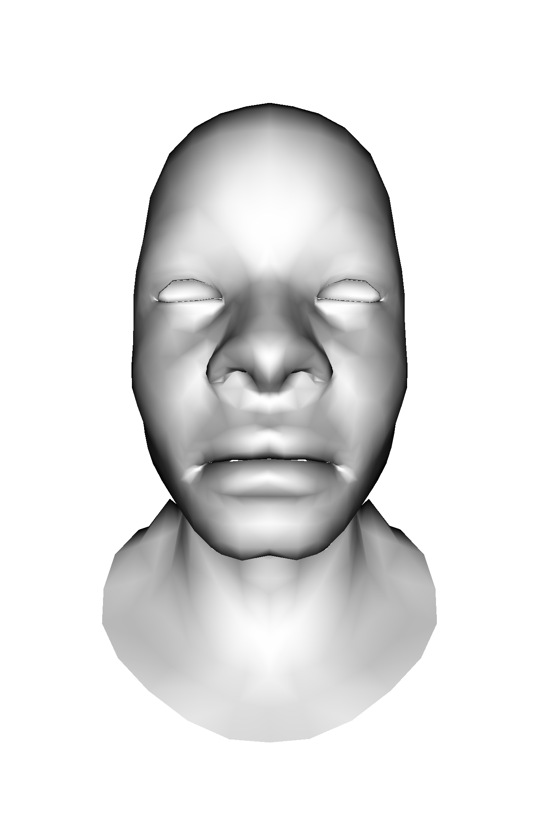
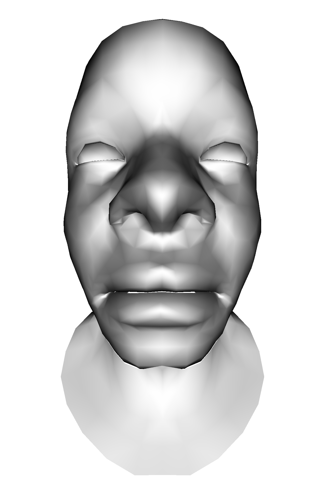

# go-render

This is a toy project to learn Go and rendering at the same time.

> Basics

|||
|--|--|
|Wireframe|Triangle rasterization|
|||

> Shading
|Flat shading|Gouraud shading|Phong shading|
||||

> Perspective

|||||
|--|--|--|--|
|||||
## TODO
- Center align
- Projections