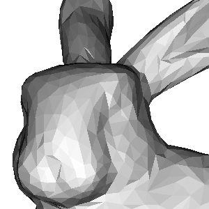

# go-render

This is a toy project to learn Go and rendering at the same time.

> Basics

|||
|--|--|
|Wireframe|Triangle rasterization|
|||

> Shading

|Flat shading|Gouraud shading|Phong shading|
|--|--|--|
||||
||||

> Perspective

|||||
|--|--|--|--|
|||||

## `.obj` sources
- https://www.prinmath.com/csci5229/OBJ/index.html
- https://people.sc.fsu.edu/~jburkardt/data/obj/obj.html
- https://groups.csail.mit.edu/graphics/classes/6.837/F03/models/