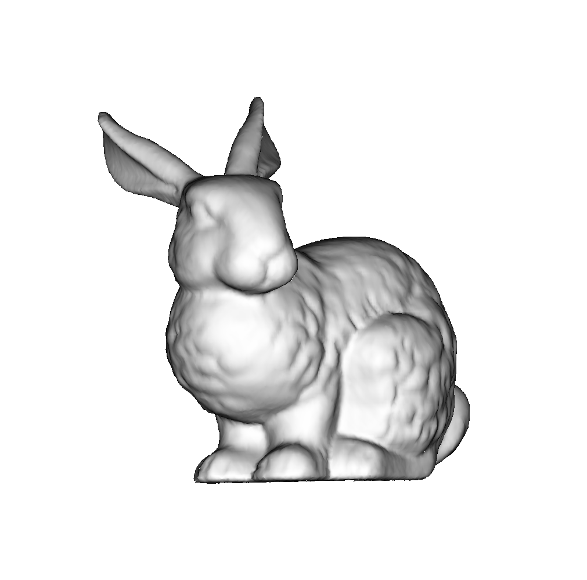

# go-render

This is a toy project to learn Go and rendering at the same time.

    
    

The OG [tinyrenderer](https://github.com/ssloy/tinyrenderer) project helped me alot. It's some great stuff, and I highly recommend everyone check it out.

## Demo 

> Basics

|||
|--|--|
|Wireframe|Triangle rasterization|
|||

> Shading

|Flat shading|Gouraud shading|Phong shading|
|--|--|--|
||||
||||

> Perspective

|||||
|--|--|--|--|
|||||

> Textures

Kudos to the author of [this article](https://blenderartists.org/t/uv-unwrapped-stanford-bunny-happy-spring-equinox/1101297) for providing custom Stanford bunny texture files.

|Colored|Terracotta|
|--|--|
|||

> Camera

|||||
|--|--|--|--|
|||||
|||||

> Light

|||||
|--|--|--|--|
|||||
||||

## `.obj` sources
- https://www.prinmath.com/csci5229/OBJ/index.html
- https://people.sc.fsu.edu/~jburkardt/data/obj/obj.html
- https://groups.csail.mit.edu/graphics/classes/6.837/F03/models/